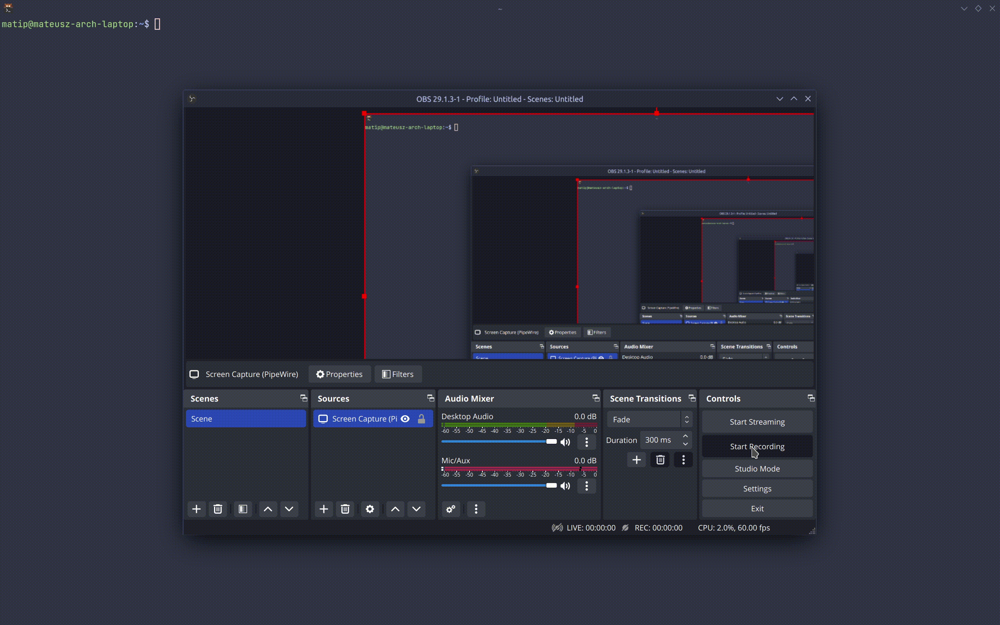

# Snow-rs
Feel the winter in your terminal with this animation.
## Options

Use the following arguments in any combination:

 - `storm`: increase snowflake density for a real snowstorm!
 - `fast`: increase snowflake falling speed
 - `color` or `colorful`: make your snowflakes colorful
 - `sausage`: get a chance to catch some food falling from the sky!
 
 ## Showcase
 